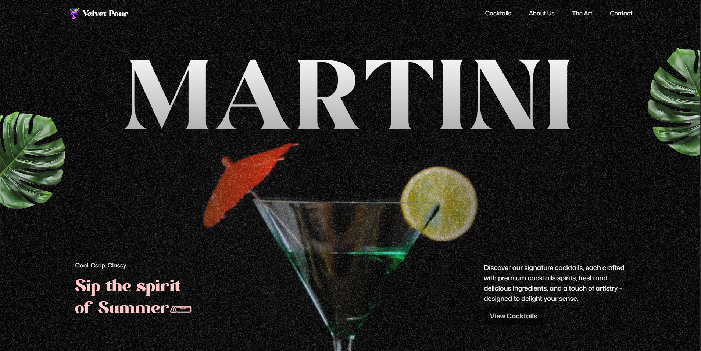
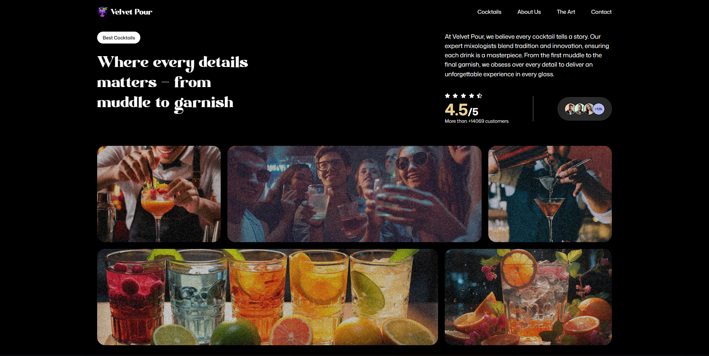
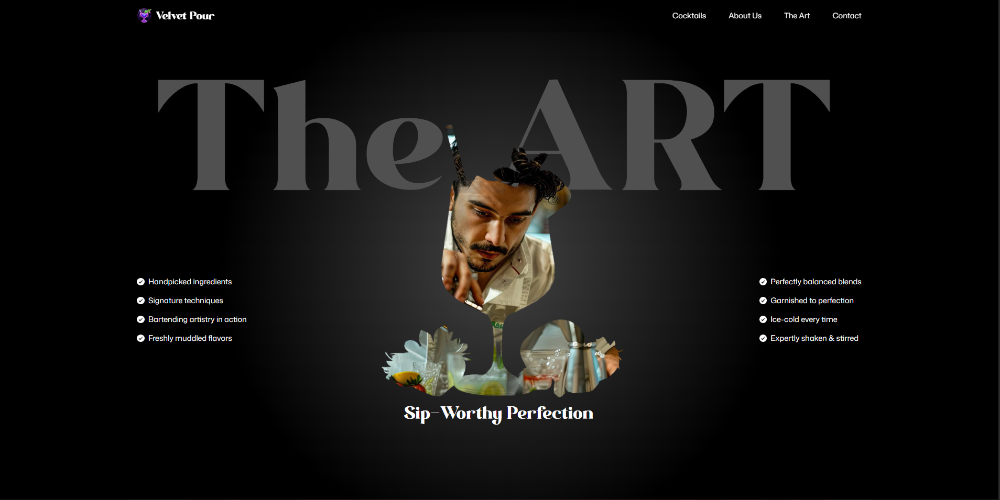
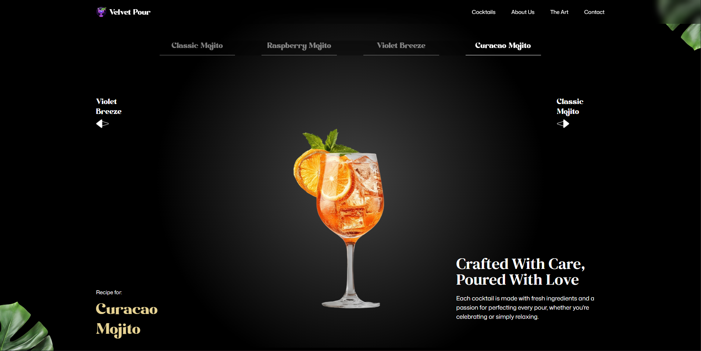

# Velvet Pour

A modern, animated cocktail bar website built with React, GSAP, and Tailwind CSS. This project showcases a visually rich, interactive single-page experience for a fictional bar, featuring smooth scroll-based animations, a dynamic menu, and a responsive design.

---

## ✨ Features

- **Animated Hero Section**: Eye-catching text and video reveal using GSAP and SplitText.
- **Cocktail & Mocktail Menu**: Interactive, animated slider for featured drinks.
- **About & Art Sections**: Scroll-triggered animations, custom grids, and masked images.
- **Contact & Info**: Animated contact details, opening hours, and social links.
- **Fully Responsive**: Mobile-first design with adaptive layouts.
- **Custom Fonts & Styling**: Uses Modern Negra and DM Serif Text for a unique look.

---

## 🖥️ Tech Stack

- **Framework**: React 19 + Vite 7
- **Animations**: GSAP 3, `@gsap/react`
- **Styling**: Tailwind CSS v4 (`@tailwindcss/vite`)
- **Icons/Utils**: `react-icons`, `react-responsive`

---

## 📦 Requirements

- Node.js 18+ (LTS recommended)
- npm 9+ (or use pnpm/yarn if you prefer)

---

## 🚀 Quick Start

```bash
# Install dependencies
npm install

# Start dev server (http://localhost:5173)
npm run dev

# Build for production (outputs to dist/)
npm run build

# Preview production build locally
npm run preview
```

---

## 🔧 Available Scripts

- **dev**: Start Vite dev server
- **build**: Production build
- **preview**: Preview the `dist` build
- **lint**: Run ESLint

---

## 🗂️ Project Structure

```
.
├─ public/                 # Static assets served as-is
│  ├─ fonts/
│  ├─ images/
│  ├─ readme/              # Screenshots used in this README
│  └─ videos/
├─ src/
│  ├─ components/          # React components (Hero, About, Menu, etc.)
│  ├─ constants/           # Data constants (menu items, social links)
│  ├─ index.css            # Tailwind layer + custom CSS
│  ├─ App.jsx              # App layout & sections composition
│  └─ main.jsx             # App entry, React root
├─ index.html              # Vite HTML entry
├─ vite.config.js          # Vite + Tailwind plugin config
└─ eslint.config.js        # ESLint config
```

---

## 🎨 Styling & Animations

- Tailwind v4 is configured via the Vite plugin (`@tailwindcss/vite`). No separate config file needed.
- Global styles live in `src/index.css`.
- GSAP animations are organized inside components with `@gsap/react` hooks for lifecycle-safe animations.
- Images and videos are placed in `public/` so they can be referenced with absolute paths.

---

## 📸 Screenshots

- Hero: 
- About Us: 
- Art: 
- Cocktails: 

---

## 🧪 Tips for Development

- If animations feel janky, check that images/videos are optimized and that GSAP timelines are created only once per component mount.
- Prefer `ScrollTrigger`-based animations for scroll sections and keep selectors scoped to each component to avoid collisions.
- Use React keys and cleanup functions to prevent duplicate GSAP instances on hot reloads.

---

## 🚀 Deployment

1. Build: `npm run build`
2. Deploy the `dist/` folder to any static hosting (Netlify, Vercel, GitHub Pages, Cloudflare Pages).

For GitHub Pages with a custom domain, ensure your `base` config is set in `vite.config.js` if deploying to a subpath.

---

## 📝 License

This project is for educational and portfolio purposes. All images/videos are included for demo use.

---

## 🙌 Acknowledgements

- GSAP team for the animation library
- Tailwind CSS team for the utility-first CSS framework
- Icons from `react-icons`
